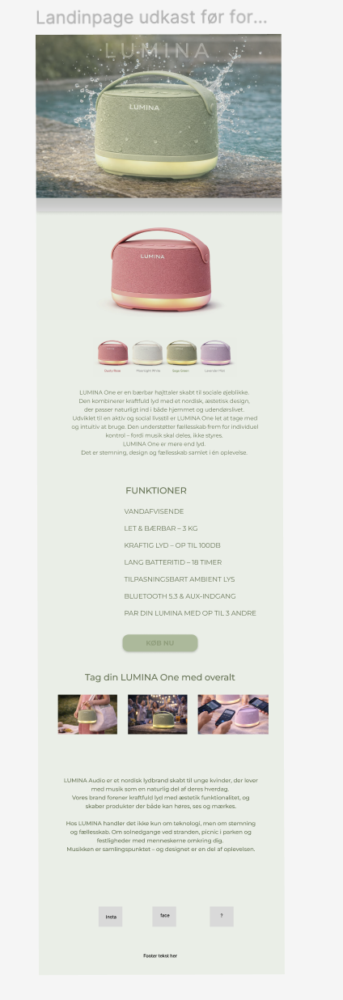
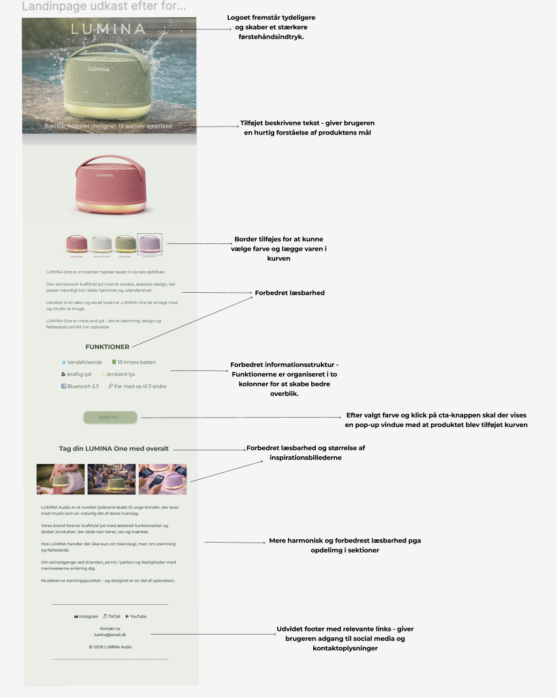
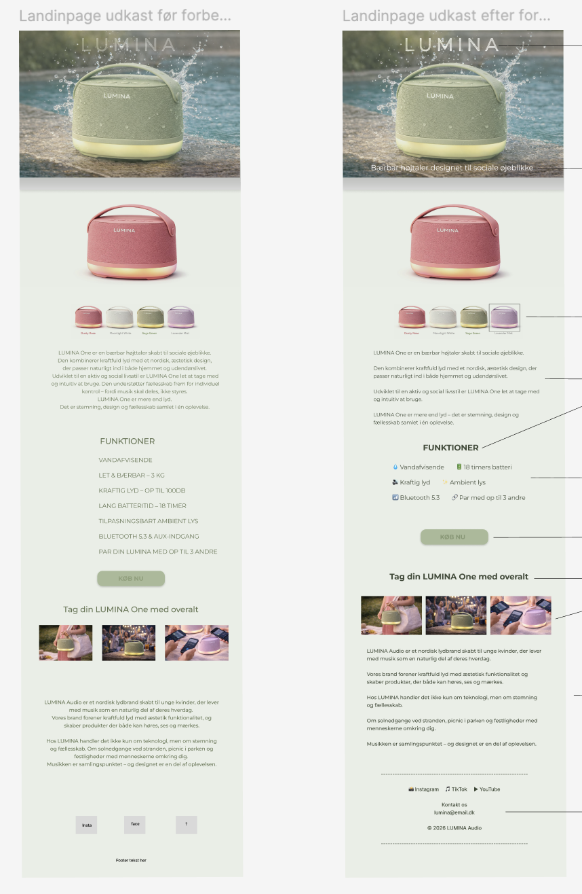
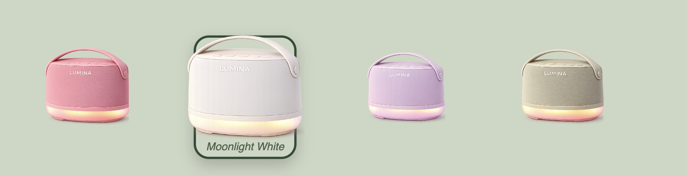
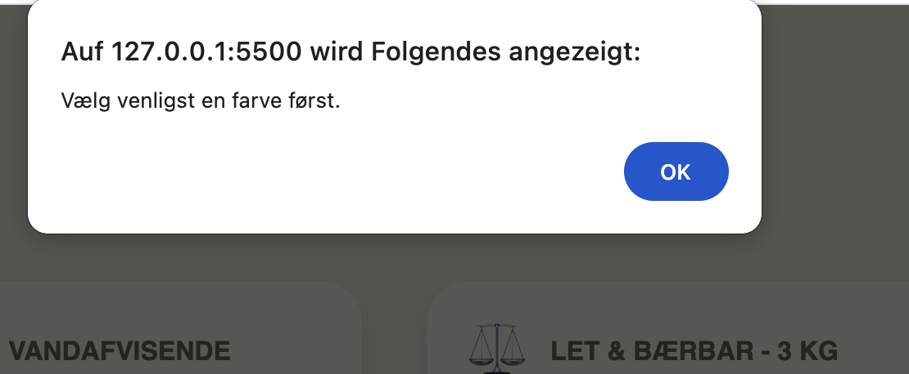
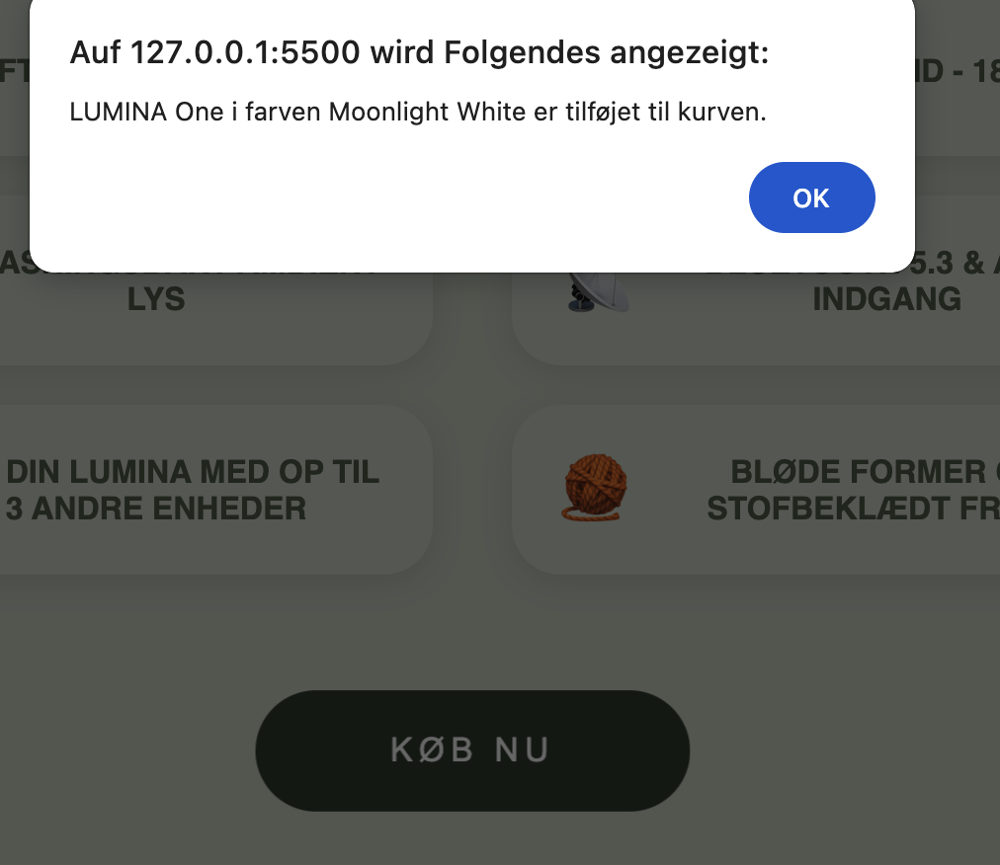
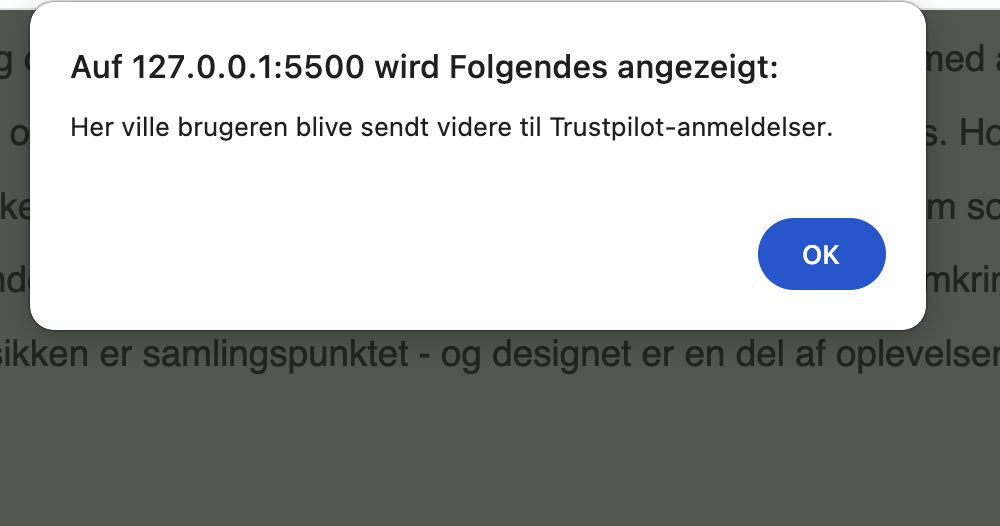
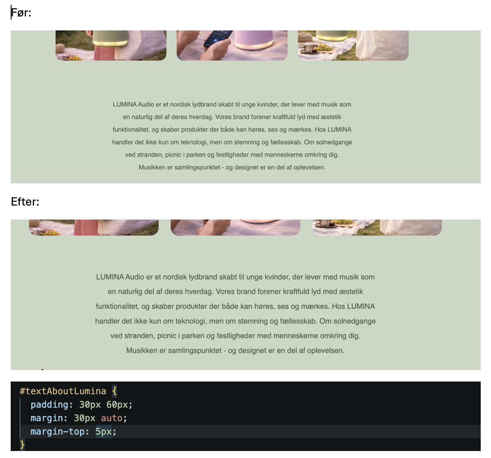

# LUMINA Landingpage

## Projektbeskrivelse

LUMINA er en responsiv landingpage udviklet som en del af mit eksamensprojekt på Multimediedesigneruddannelsen.

Formålet med projektet var at forbedre brugeroplevelsen gennem bedre navigation, tydeligere visuel feedback og mere interaktive funktioner ved hjælp af HTML, CSS og JavaScript.

Projektet blev gennemført gennem vurdering af den eksisterende prototype, redesign i Figma, analyse af landingpagen ud fra gestaltprincipperne og efterfølgende implementering i kode.

---

# Projektproces

## 1. Gennemgang af den eksisterende prototype

Det første jeg gjorde i projektet var at gennemgå den eksisterende Figma-prototype.

Jeg vurderede løsningen ud fra et UX- og UI-perspektiv og identificerede områder, hvor brugeroplevelsen kunne forbedres.

Jeg observerede blandt andet:

- Manglende visuel feedback ved interaktion
- Begrænset navigation mellem sektioner
- Manglende active states ved farvevalg
- Begrænset interaktivitet
- Footer med få relevante oplysninger

På baggrund af disse observationer udviklede jeg mine egne idéer til forbedringer af landingpagen.

---

## 2. Redesign i Figma

På baggrund af mine observationer udviklede jeg en forbedret version af den eksisterende prototype i Figma.

Målet var at skabe en mere brugervenlig og engagerende landingpage med tydeligere navigation, bedre informationsstruktur og mere visuel feedback.

### Oprindelig prototype

Den oprindelige prototype fungerede som udgangspunkt for redesignprocessen.

---

### Redesignet prototype

I den forbedrede version arbejdede jeg blandt andet med:

- Mere synligt logo
- Beskrivende tekst i hero-sektionen
- Tydeligere produktinformation
- Bedre informationsstruktur
- Større inspirationsbilleder
- Mere informativ footer

---

### Oversigt over forbedringer

#### Hero-sektion

- Logoet blev gjort mere synligt
- Beskrivende tekst blev tilføjet for at kommunikere produktets funktion hurtigere

#### Produktsektion

- Farvevalgene blev gjort tydeligere
- Produktområdet blev gjort mere overskueligt
- Købsflowet blev forbedret

#### Informationsstruktur

- Produktbeskrivelsen blev gjort mere læsbar
- Funktionerne blev organiseret i to kolonner for bedre overblik

#### Inspirationssektion

- Billederne blev gjort større
- Layoutet blev gjort mere harmonisk

#### Footer

- Sociale medier blev tilføjet
- Kontaktoplysninger blev tilføjet
- Footeren blev gjort mere informativ

---

## 3. Analyse af landingpage ud fra gestaltprincipper

Efter redesignfasen analyserede jeg landingpagen ud fra gestaltprincipperne for at vurdere designets styrker og svagheder.

Analysen fokuserede på usability, readability, visual hierarchy og interaktivitet.

### Proximity (Nærhed)

**Det fungerede godt:**

- Produktbilleder og farvevalg var placeret tæt sammen
- Funktionerne var organiseret i overskuelige grupper

**Forbedringsmuligheder:**

- CTA-knapper kunne forbindes tydeligere med produktet
- Mere visuel feedback ved interaktion

### Similarity (Lighed)

**Det fungerede godt:**

- Konsistent farvepalette
- Sammenhængende typografi

**Forbedringsmuligheder:**

- Tydeligere active states ved farvevalg
- Mere feedback på CTA-knapper

### Continuity (Kontinuitet)

**Det fungerede godt:**

- Simpelt layout med fokus på produktet
- Hero-sektionen guidede brugeren videre gennem siden

**Forbedringsmuligheder:**

- Smooth scrolling mellem sektioner
- Stærkere flow gennem siden

### Figure/Ground

**Det fungerede godt:**

- Produktet var det primære fokuspunkt

**Forbedringsmuligheder:**

- Mere synlige CTA-knapper
- Tydeligere visuel feedback

### Simplicity / Prägnanz

**Det fungerede godt:**

- Minimalistisk design
- Overskuelig struktur

**Forbedringsmuligheder:**

- Flere interaktive elementer
- Mere feedback til brugeren ved handlinger

### Konklusion

På baggrund af analysen valgte jeg at fokusere på:

- Active states
- Hover-effekter
- JavaScript-baseret interaktivitet
- Visuel feedback
- Navigation
- Brugeroplevelse

---

## 4. Implementering i HTML, CSS og JavaScript

De designmæssige forbedringer blev efterfølgende implementeret i kode.

### Smooth Scrolling

Jeg implementerede smooth scrolling ved hjælp af JavaScript og `scrollIntoView()`.

Når brugeren klikker på:

- "Læs mere"
- "Køb nu"

scroller siden automatisk til produktsektionen.

Dette forbedrer navigationen og skaber et mere naturligt flow.

---

### Optimering af button-ID'er

Jeg ændrede button-ID'erne til mere beskrivende navne.

Dette gør JavaScript-koden mere overskuelig og lettere at vedligeholde.

---

### Produktsektion med navigation

Jeg tilføjede ID'et `produktinfo` til produktsektionen.

Dette gør det muligt for JavaScript at navigere direkte til produktområdet.

---

### Interaktivt farvevalg

Jeg implementerede et interaktivt farvevalg ved hjælp af JavaScript.

Når brugeren vælger en farve:

- Markeres den valgte farve
- Andre farver fravælges automatisk
- Valget gemmes i JavaScript

---

### Active States og visuel feedback

Jeg implementerede active states ved hjælp af CSS.

Den valgte farve får:

- Border
- Shadow-effekt
- Scaling-animation

Derudover blev der tilføjet:

- Hover-effekter
- Cursor-effekter
- Transition-effekter

for at forbedre brugeroplevelsen.

---

### Dynamisk valg og fravalg af farver

Farvevalgene blev gjort dynamiske.

Hvis brugeren klikker på samme farve igen:

- Markeringen fjernes
- Valget nulstilles

Hvis brugeren vælger en anden farve:

- Tidligere active state fjernes
- Den nye farve markeres automatisk

---

### Køb nu-funktion

Jeg implementerede funktionalitet på "Køb nu"-knappen.

Hvis ingen farve er valgt:

- Der vises en advarselsbesked

Hvis en farve er valgt:

- Der vises en bekræftelsesbesked med den valgte farve

Dette giver brugeren tydelig feedback på handlingen.

---

### Trustpilot-sektion

Jeg gjorde Trustpilot-knappen interaktiv ved hjælp af JavaScript.

Når brugeren klikker på knappen, modtager brugeren feedback, hvilket gør sektionen mere levende og interaktiv.

---

### Layoutforbedringer

Jeg reducerede afstanden mellem inspirationsbillederne og tekstsektionen ved hjælp af CSS.

Dette skaber:

- Bedre visuel balance
- Mere sammenhængende layout
- Forbedret læsbarhed

---

# Teknologier

- HTML5
- CSS3
- JavaScript
- Figma
- GitHub
- GitHub Pages

---

# Refleksion

Gennem projektet har jeg arbejdet med hele UX-processen fra idé og vurdering til implementering.

Jeg startede med at evaluere den eksisterende prototype, udviklede en forbedret version i Figma og analyserede derefter landingpagen ud fra gestaltprincipperne for at identificere styrker og svagheder i designet.

På baggrund af dette implementerede jeg forbedringerne i HTML, CSS og JavaScript.

Projektet har givet mig erfaring med:

- UX-analyse
- Gestaltprincipper
- UI-design
- Prototyping i Figma
- Frontend-udvikling
- JavaScript-interaktioner
- Visuel feedback
- Brugercentreret design
- Git og GitHub

---

# Links

## GitHub Repository

Indsæt link her

## GitHub Pages

Indsæt link her

## Figma Design

Indsæt link her

## Figma Prototype

Indsæt link her
